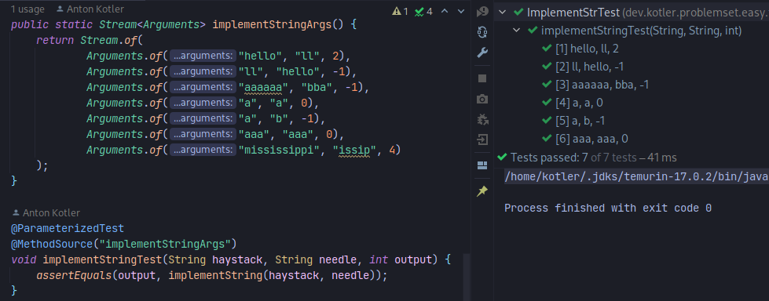

## Java Practice - LeetCode

[Problemset](https://github.com/kotler-dev/java-leetcode/blob/master/src/test/java/dev/kotler/problemset/easy/) - including problem statement and solution.  

[//]: # ([1. Two Sum]&#40;https://github.com/kotler-dev/java-leetcode/blob/master/src/test/java/dev/kotler/problemset/easy/task100/TwoSumTest.java&#41;  )
[//]: # ([9. Palindrome Number]&#40;https://github.com/kotler-dev/java-leetcode/blob/master/src/test/java/dev/kotler/problemset/easy/task100/PalindromeNumberTest.java&#41;  )
[//]: # ([13. Roman to Integer]&#40;https://github.com/kotler-dev/java-leetcode/blob/master/src/test/java/dev/kotler/problemset/easy/task100/RomanToIntegerTest.java&#41;  )
[//]: # ([14. Longest Common Prefix]&#40;https://github.com/kotler-dev/java-leetcode/blob/master/src/test/java/dev/kotler/problemset/easy/task100/LongestCommonPrefixTest.java&#41;  )
[//]: # ([20. Valid Parentheses]&#40;https://github.com/kotler-dev/java-leetcode/blob/master/src/test/java/dev/kotler/problemset/easy/task100/ValidationBracketsTest.java&#41;  )
[//]: # ([21. Merge Two Sorted Lists]&#40;https://github.com/kotler-dev/java-leetcode/blob/master/src/test/java/dev/kotler/problemset/easy/task100/MergeTwoSortedListsTest.java&#41;  )
[//]: # ([26. Remove Duplicates from Sorted Array]&#40;https://github.com/kotler-dev/java-leetcode/blob/master/src/test/java/dev/kotler/problemset/easy/task100/RemoveDuplicatesFromSortedArrayTest.java&#41;  )
[//]: # ([27. Remove Element]&#40;https://github.com/kotler-dev/java-leetcode/blob/master/src/test/java/dev/kotler/problemset/easy/task100/RemoveElementTest.java&#41;  )
[//]: # ([28. Implement strStr&#40;&#41;]&#40;https://github.com/kotler-dev/java-leetcode/blob/master/src/test/java/dev/kotler/problemset/easy/task100/ImplementStrTest.java&#41;  )
[//]: # ([35. Search Insert Position]&#40;https://github.com/kotler-dev/java-leetcode/blob/master/src/test/java/dev/kotler/problemset/easy/task100/SearchInsertPositionTest.java&#41;  )
[//]: # ([88. Merge Sorted Array]&#40;https://github.com/kotler-dev/java-leetcode/blob/master/src/test/java/dev/kotler/problemset/easy/task100/MergeSortedArrayTest.java&#41;  )
[//]: # ([94. Binary Tree Inorder Traversal]&#40;https://github.com/kotler-dev/java-leetcode/blob/master/src/test/java/dev/kotler/problemset/easy/task100/BinaryTreeInorderTraversalTest.java&#41;  )
 